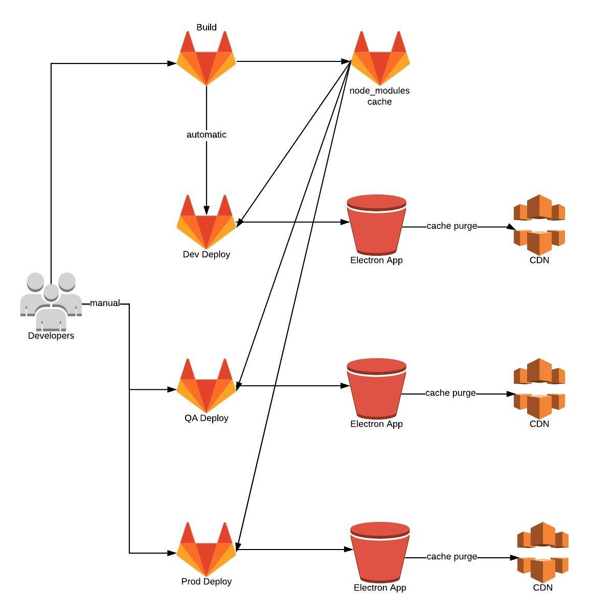
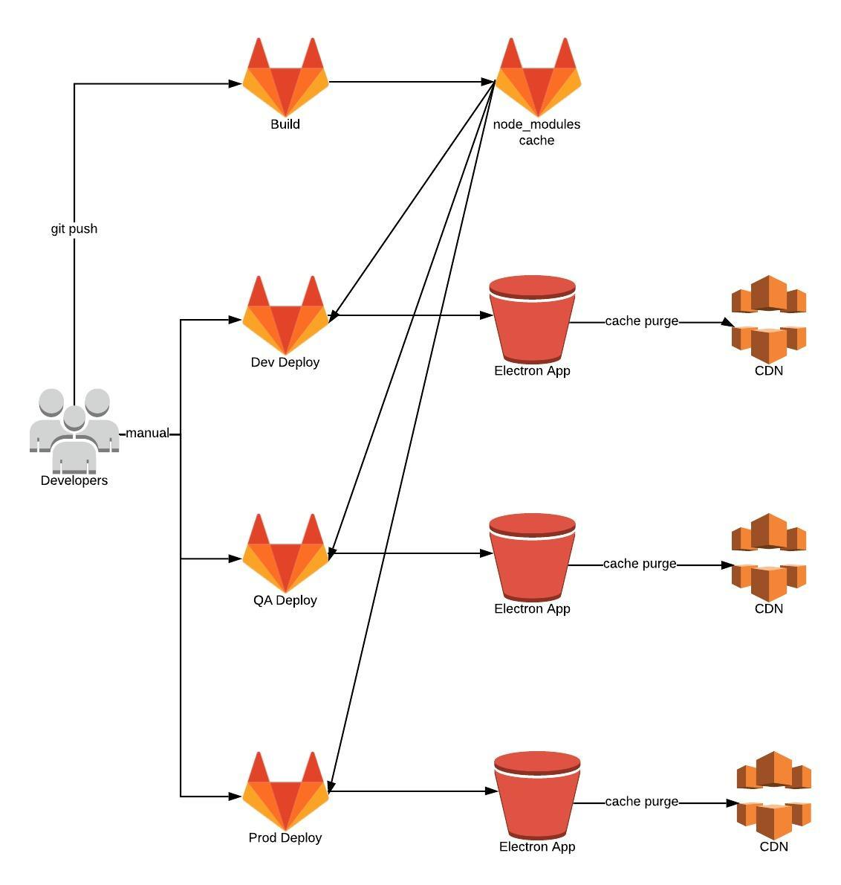

# Frontend CICD

## Normal CICD Workflow

## Hotfix CICD Workflow

## Workflow
This folder contains everything needed to deploy the frontend.  The process is broke into two parts:
1. Get dependencies for use in all environments.
2. Build and Deploy the electron app for a given environment

## Dependencies
In order to have safe and repeatable builds for all environments node modules are retrieved in a separate job and then put in the GitlabCI cache.  This cache is then retrieved by ALL deployments for the commit that triggered the build.  This should guarantee that there are no breaking minor changes between releases to higher environments. And because the cache is tied to a commit hash any rollbacks should use the exact same node modules they did originally.

## Build and Deploy
After the node modules have been cached the development deployment will kick off automatically (unless triggered by a hotfix branch). Deployment to higher environments is do manually.  The deployments will retrieve the node modules from the GitlabCI cache and then run the necessary npm scripts to build an Electron app and push it to an S3 bucket.

#### Some things to note:
* The AWS creds for GitlabCI are admin creds, be careful.
* If the build is failing on AWS commands make sure that the branch/tag/etc you are using is marked as "protected" so that it gets the environment variables with the AWS keys.
* Some pipeline variables are environment specific.  The Environments name in the Gitlab settings page must match the environment.name property in gitlab-ci.yml file. 

## Terraform
The Terraform in this repository contains all the AWS infrastructure specific to the frontend.  That is:
* An S3 bucket for the Electron app and corresponding log bucket and policy
* A Cloudfront Distribution (CDN) for the app bucket
* A Route53 record that points to the CDN

### How To Create a New Environment
Creating a new environment is done by copying the following items and change the appropriate names:
* Any of the existing environment folders under cicd/terraform
* One of the existing deploy stage jobs from .gitlab-ci.yaml
* All the bits needed for the npm scripts to run (.env files, electron build files, etc)

A few things to note:
* Make sure to remove any .terraform folders in the copied directories.
* Make sure to change the key in the terraform backend in main.tf to be something unique.

Once you have taken care of things you can run terraform init and terraform apply in your newly created directory and this will create the bucket, cdn, and DNS record for your new environment. 
