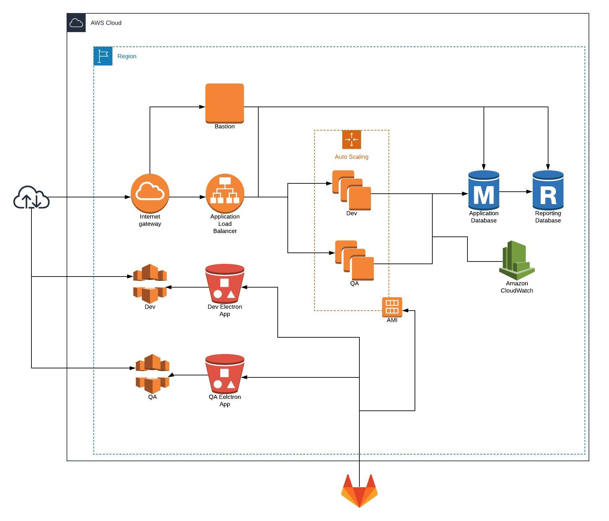
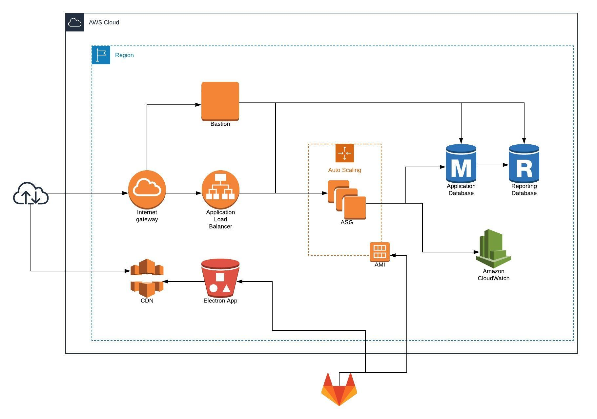

#  Infrastructure
This repository contains the Terraform configuration and other scripts required for $CUSTOMER's AWS infrastructure.  It is broken into the following parts.

## CICD
The pieces required for Gitlab CI to work.  This includes:
* An S3 bucket to hold artifacts for the Packer builds
* An IAM user for GitlabCI to use for ALL jobs (this really should be separated and reduced in scope)
* IAM Policies, Roles, and Attachments for the Packer instance

## SFTP
A main Terraform configuration for provisioning an AWS Transfer Server and a module for users said server.  The main configuration will provision an SFTP Transfer Server, configure it's CloudWatch logging role, and a Route53 record that will point to the new server.  The rest of the configuration contains the users as implemented by the module.

The module will provision a bucket (and corresponding log bucket) then all of the necessary IAM bits before creating an AWS Transfer User and SSH Key.  It should be noted that this method only maps one user to one bucket and gives that user full read and write access to that bucket.  If anything more complex than this is required it will have to be done outside of this module.  

## Nonprod
A Terraform configuration for all of the shared infrastructure needed for the non production environment.  This includes:
* A VPC with a private, public, and database subnet in each AZ.  No NAT Gateway. The required VPC endpoints being used by any applications
* The KMS key being used for CloudWatch logs
* The primary internet facing ALB for all applications as well as a default healthy response and an HTTP to HTTPS redirect
* An SSH bastion for trouble shooting.  This should have access to any application servers as well as databases in the VPC
* A commented out test instance for troubleshooting AMI's
* Misc security groups that don't belong to something specifically in this configuration. This includes per application per env security groups as well as one per VPC endpoint
* The shared application RDS instance as well as a commented out reporting instance configured to be a read replica of the application instance
* Scripts for provisioning a Postgres user and database per environment

## Prod
The same as non prod but with no shared components and only one environment. 

## How To Create a New Environment For The API
To create a new environment you will have to create a few "global" resources here before you can add a new ASG in the API's repository:
* A Security Group that allow ingress of the ports used for the API as well as SSH
* A null resource and template file for running the DB scripts to create a user and database

Once these are created you can then duplicate one of the existing environments in the API changing values appropriately.
