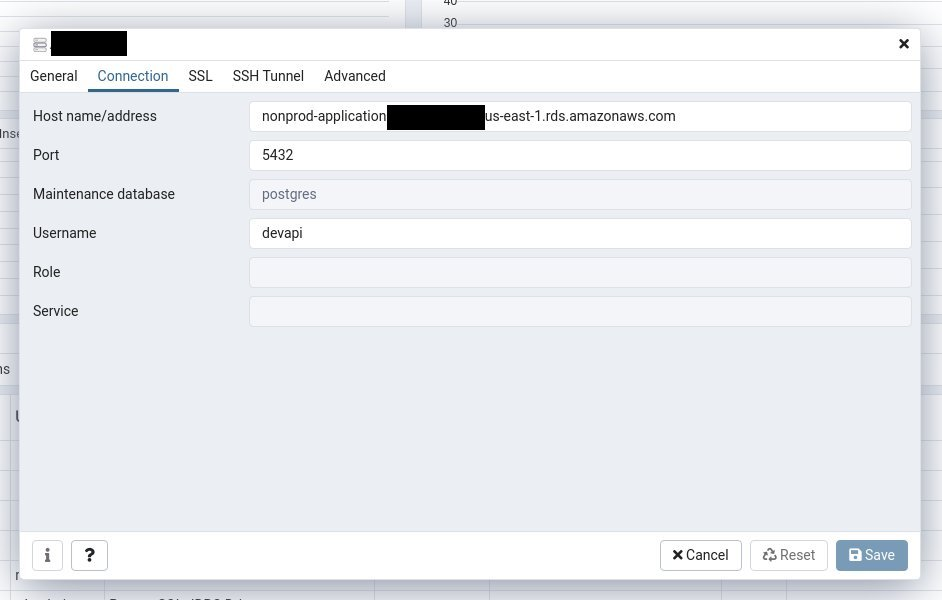
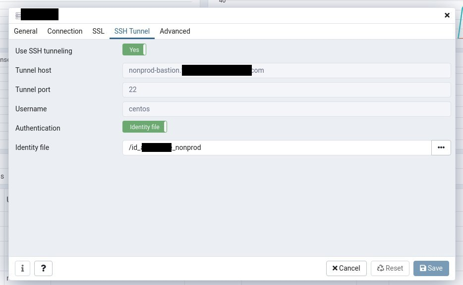

# Database

## Developer/Troubleshooting/Seed Access
In all environments the database instance is not directly exposed to the internet; it can only be accessed by either one of the API servers or the bastion. In order to connect to the database instance from somewhere else you will need to tunnel thru the bastion.  This is achieved two different ways.

If you need to use the psql command line tool or run a script it is best to open an ssh tunnel in another terminal and then run a command like the following to create the tunnel:

    ssh -v -4 -i [/path/to/key] -N -L 5433:[database host]:5432 centos@[bastion name]

If you would like to use a graphical tool most have an option for adding the tunnel there.  See below screenshots for an example with pgadmin.

## Authentication
### SSH
Regardless of how you use the tunnel, in order to make the ssh connection you will need an ssh key to authenticate.  This key will need to be accessible by whatever **client** software you are using to connect the database.  For local use this probably means your laptop, if you are remoted into another system then you will need to copy the key there as well.

### Database
Each database user has it's own password.

## Layout
There are two database instances: prod and nonprod.  All databases that are not the production database (dev, qa, etc.) will share the nonprod instance while production will get its own instance. Since this is also how the networks are divided there will correspondingly be two bastion servers and associated ssh keys.  The admin user for each instance is only used to create the database and a separate user for each environment.  The environment specific users have all permissions on their corresponding database but are unable to drop and recreate them.  Keep this in mind when creating scripts.

### nonprod
* keyname: id_$APP_nonprod_infra
* database host: nonprod-application.$RANDOM.us-east-1.rds.amazonaws.com
* bastion name: nonprod-bastion.$APP.com
* admin user: nonprodadmin
* dev
    * Database: dev$APP
    * User: devapi
* qa
    * Database: qa$APP
    * User: qaapi

### prod
* keyname: id_$APP_prod_infra
* database host: prod-application.$RANDOM.us-east-1.rds.amazonaws.com
* bastion name: prod-bastion.$APP.com
* admin user: prodadmin
* prod
    * Database: $APP
    * User: api